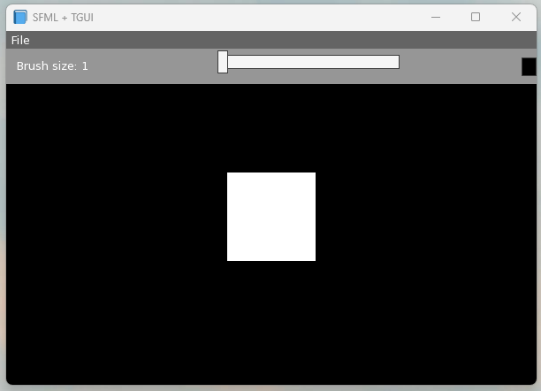
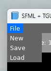
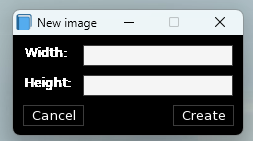
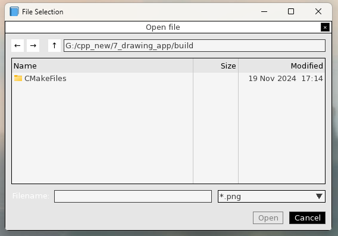

# Drawing application
This is a small and simple drawing application. The project was mainly created for educational purposes. It's one of my first small projects i developed in c++ to get familiar with the language.

## Application images

## Features
- Create new image with custom size
- Save / load images
- Select images for loading/saving via file selector
- Change the brush size and the brush color
- Draw via left mouse click on the canvas
- Zoom into the image via scroll wheel up/down 
- Move the image view around via moving the mouse while holding down right mouse button

## Download / Try the app
You can find a release version in the releases section here in the repository. Feel free to download and try the app!

## Development informations
### Setup (for windows + visual studio code):
1. Install [MSYS2](https://www.msys2.org/) on your system - For easiest setup use the default directory given by the installer (C:\MSYS2)
2. Open "MSYS2 MINGW32" (you should find it via your windows application search)
3. Install the mingw32 toolchain via `pacman -S mingw-w64-i686-toolchain`
4. Clone this project into a place of your choice
5. Open the directory in visual studio code
6. Have fun with it! The repository provides configuration files for visual studio code so building the application should be possible via Strg+Shift+B and when you press F5 for running the application it's automatically build the debug version before it starts running.

### For those who didn't install MSYS2 into the default directory (C:\MSYS2)
Please replace all directory paths in the .vscode directory from C:\MSYS2 to your custom directory. The path should also end with the MSYS2 folder (e.g D:\MY\CUSTOM\PATH\MSYS2). One of the easiest way is to use the search tab in visual studio code.